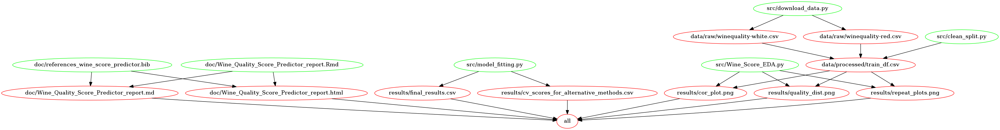

# Wine Quality Score Predictor

Contributors: Kingslin Lv, Manju Neervaram Abhinandana Kumar, Zack Tang, Pavel Levchenko

Wine Quality Score Predictor is our data analysis project for the 2021-22 UBC MDS DSCI 522 course.

## Introduction

The aim of this project is to predict the quality of wine on a scale of 0 to 10 given a set of physiochemical features rated by wine test reviewers as inputs. This model is useful to support wine tasting evaluations. The data set for this project is related to red and white vinho verde wine samples, from Portugal, created by P. Cortez, A. Cerdeira, F. Almeida, T. Matos and J. Reis. It is sourced from the UCI Machine Learning Repository and can be found [here](https://archive.ics.uci.edu/ml/datasets/wine+quality). Each row in the data set represents label of wine (red or white) and its physicochemical properties which includes fixed acidity, volatile acidity, citric acid, residual sugar, chlorides, free sulfur dioxide, total sulfur dioxide, density, pH, and sulphates.

We built a regression model using Ridge, One-Vs-Rest Logistic Regression, SVR, and Random Forest Regressor. To solve the class imbalance issue we found in [EDA](https://github.com/UBC-MDS/DSCI_522_Group19_Wine_Quality_Score_Predictor/blob/main/src/Wine_Score_EDA.ipynb), we decided to use over-sampling method to balance each class and passed oversampled train data set to different models. Running through the cross-validation, we found the Random Forest Regressor delivers a much higher training score, but there was a clear case of overfitting issue. And the scoring matrix we used in the model are negative mean squared error, negative root mean squared error, negative mean absolute error, r squared and mape scorer. We then ran hyperparameter optimization for some typical hyperparameters of random forest regressor in an attempt to improve the model. Unfortunately, the test score with the best hyperparameters was only around 0.53. After analyzing feature coefficients by using Recursive Features Elimination (RFE), we reduced to have 10 features. Some features have low coefficients as what was expected from our initial [EDA](https://github.com/UBC-MDS/DSCI_522_Group19_Wine_Quality_Score_Predictor/blob/main/src/Wine_Score_EDA.ipynb). **Please note that running the project may take some computation resources and time, the estinated time is around 10 minutes.**

## Report

The final report can be found [here](https://github.com/UBC-MDS/DSCI_522_Group19_Wine_Quality_Score_Predictor/blob/main/doc/Wine_Quality_Score_Predictor_report.md)

## Usage
**1. Using Docker**

Note: In order to run the instructions in this section, a unix shell (e.g., terminal or Git Bash) is required. 

To replicate the analysis, install the [Docker](https://www.docker.com/get-started) on your PC, then clone the GitHub repository and run the following commands at the terminal/command line from the root directory of this project:

```
place holder #1
```

To reset the repo to a clean state, with no intermediate or results files, please run the following commands at the terminal/command line from the root directory of this project:

```
place holder #1
```

**2. Using `Make`**

To replicate the analysis, clone this GitHub repository, install the [dependencies](#dependencies) listed below, and run the following commands from the main directory of the project:
```
make all
```
To reset the repo to a clean state, with no intermediate or results files, please run the following command at the command line/terminal from the root directory of this project:
```
make clean
```

## Dependencies

To run this project, please install

-   Python version 3.8.6 and the required dependencies from [here](https://github.com/UBC-MDS/DSCI_522_Group19_Wine_Quality_Score_Predictor/blob/main/env-wine-prediction.yaml) by running the following command at the command line/terminal

To set up the necessary packages for running the data analysis materials from wine score prediction, [download the environment file from the repo to your computer](https://github.com/UBC-MDS/DSCI_522_Group19_Wine_Quality_Score_Predictor/blob/main/env-wine-prediction.yaml) (hit "Raw" and then `Ctrl` + `s` to save it, or copy paste the content). Then create a Python virtual environment by using `conda` with the environment file you just downloaded:

``` bash
# create a conda environment using the `env-wine-prediction.yaml`
conda env create --file env-wine-prediction.yaml
conda activate wine
```

-   R version 4.0.2. and R packages:

    -   knitr==1.30
    -   feather==0.3.5
    -   kableExtra==1.3.1
    -   tidyverse==1.3.0
    -   docopt==0.6.2

- GNU make 4.2.1
  
- Vega-Lite and Canvas
    - these must be installed into base environment using command `npm install -g vega vega-lite vega-cli canvas`

## Dependency diagram

  
  
## License

Datasets of this project are licensed under a Creative Commons Attribution 4.0 International (CC BY 4.0) license. This allows for the sharing and adaptation of the datasets for any purpose, provided that the appropriate credit is given.
