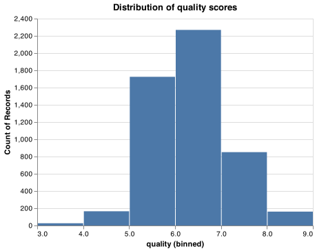
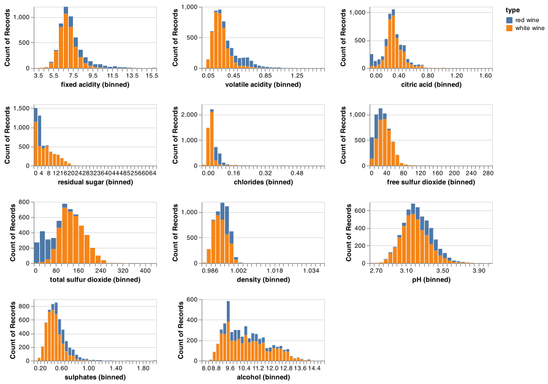
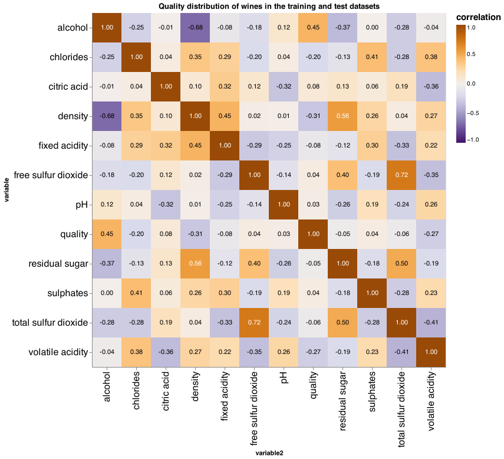

# Summary

In this project we aim to predict the wine quality scores ranging from 0
to 10 based on physicochemical properties of wines sensory tests. To
answer this predictive question, we decide to build a regression model.
Through our exploratory data analysis we analyze the distribution of
each feature and correlation between features and the target. Then
through the cross-validation process based on feature input, we
concluded that the Random Forest model delivers a much higher training
score, but there was a clear problem of overfitting. We further conduct
feature selection and hyperparameter optimization in an attempt to
reduce the score gap between train and test data. We are able to drop
number of features but maintain the relatively similar score through
this process. Unfortunately, the test score with the best
hyperparameters was only around 0.52, which is fairly acceptable. Next
we potentially can improve our model prediction score by using a larger
dataset with more features and find a more high score model with its
best hyperparameters.

# Introduction

The wine industry shows a recent extensive growth and the industry
experts are using product quality certifications to promote their
products(Orth and Krška 2001). This is a time-consuming process and
requires the assessment given by human experts, which makes this process
very expensive. The wine market would be of interest if the human
quality of tasting can be related to wine’s chemical properties so that
quality assessment processes are more controlled. This project aims to
build up a machine learning model for purpose of predicting the wine
quality score based on specific chemical properties of each beverage.
This task will likely require a lot of domain knowledge and according to
a paper published by Dr. P. Cortez, Dr. A. Cerdeira, Dr. F. Almeida,
Dr. T. Matos and Dr. J. Reis they were able to demonstrate the results
of a data mining approach had promising results compared to alternative
neural network methods (Cortez et al. 2009).

This model is useful to support wine tasting evaluations. Quality
evaluation is part of wine certification process and can be used to
improve wine making and classify wines to premium brands which can be
useful for setting prices and for marketing purposes based on consumer
tastes. It should be noted that using taste as a sensory measurement for
wine quality could be quite unreliable. We are also interested in
exploring how much output data could depend on other sensory information
such as color of wine. Potentially, human brain could be processing
taste and visual information differently rather than taste only. Thus,
we are not expecting to obtain a really high test score.

# Methods

## Data

The dataset used in this project was retrieved from the University of
California Irvine (UCI) machine learning repository (Dua and Graff 2017)
and was collected by Paulo Cortez, University of Minho, Guimarães,
Portugal and A. Cerdeira, F. Almeida, T. Matos with help from J. Reis,
Viticulture Commission of the Vinho Verde Region(CVRVV), Porto, Portugal
in 2009. This dataset contains the results of various physiochemical
test, including scoring for properties like fixed acidity, volatile
acidity, citric acid, residual sugar, chlorides, free sulfur dioxide,
total sulfur dioxide, density, pH, sulphates, and alcohol (11 features),
which were preformed on white “Vinho Verde” wine samples from Northern
Portugal. The data used in our analysis can be found
[here](https://archive.ics.uci.edu/ml/datasets/wine+quality).
Additionally, we add one more feature by concatenating white and red
wine data, and so there is a binary feature; we think potentially
human’s perception of wine type may affect the independent scoring on
the wine quality, thus, we added a binary feature to account for this
factor.

No additional features or specific branding of each wine is available in
the dataset for privacy purposes. Each row in the dataset represents a
single wine which was tested and scored based on human sensory data.

## Analysis

As the first step towards building the model to answer the predictive
question posed above we split the data into train and test data set at
80% and 20% level. We perform our exploratory data analysis on the
training data frame. Firstly we plotted the distribution of the quality
scores for each wine (Figure 1). Despite the quality scoring being
performed a scale from 1-10 only values in the range of 3-9 were
observed. It can be seen that our data is significantly imbalanced, with
6 being the most common score observed across all testing while scores
such as 3 and 9 were rarely seen.

Figure 1. Distribution of quality scores

After taking a look at the distributions of our 11 numerical features,
and we realize all attributes have outliers with extreme value. We will
have to scale numerical features in order to reduce skewness at the
process of building the model. Also, there is a class imbalance issues
as revealed from the distribution plot.

Figure 2. Data distribution of numeric features in training datasets.

By exploring the features correlation matrix, we identified that some
features are highly correlated, and we choose to drop some redundant
features in the process of feature selection. By the below correlation
matrix, volatile.acidity, sulphates and alcohol are the attributes most
coorelated with quality of wine. Thus, these 3 attributes are most
attractive to us. We might drop some features that have smaller
correlations such as fixed acidity and type. We will further identify
this through our model establishment process.

Figure 3. Quality distribution of wines in the training and test
datasets.

The data was processed through the pandas package; EDA was plotted using
python the library Altair and the preliminary insights on EDA was using
the pandas-profiling package (team 2020) (Brugman 2019)
(**vanderplas2018altair?**). This report was compiled using an R
document file with scripts running via the docopt package (R Core Team
2019), (de Jonge 2020). Tables were stored via feather files (with
dependency on arrow) and displayed using knitr’s kable function (Xie
2020), (Allaire et al. 2020). After tuning the model, we will use test
data set to do the final check of the accuracy. If the result is not
satisfactory, we will make further adjustments based on the new issue
found.

# Results & Discussion

After we decided to approach our problem as regression issue, we chose
to use four typical regression supervised learning models `Ridge`,
`OneVsRestClassifier`, `SVC`, and `RandomForestRegressor`(Van Rossum and
Drake 2009), Pedregosa et al. (2011)\]. To better understand the
performance of our selected models, we decided to evaluate negative mean
squared error, negative root mean squared error, negative mean absolute
error, r squared and MAPE scores given this is a regression issue with
multiple feature coefficients. The cross-validation scores for each
model is summarized in the Table 1. We discovered that
`RandomForestRegressor` returned the highest cross-validation score, and
so next we decided to further tune the `RandomForestRegressor` model via
feature selection and hyper-parameter optimization.

We applied Recursive Features Elimination (RFE) for preliminary feature
selections, and limit the number of features as 10 in order to make the
model more efficient. Through this algorithm we determined to drop
`type` and `fixed acidity` features, and we are able to achieve very
similar scores with lesser features as displayed in the Table 2. This
process simplifes our model and it’s cost-efficient for future data
collection.

<table>
<caption>Table 1. Table of cross-validation results for each tested model</caption>
<colgroup>
<col style="width: 26%" />
<col style="width: 14%" />
<col style="width: 14%" />
<col style="width: 14%" />
<col style="width: 14%" />
<col style="width: 14%" />
</colgroup>
<thead>
<tr class="header">
<th style="text-align: left;">…1</th>
<th style="text-align: left;">Ridge</th>
<th style="text-align: left;">SVC</th>
<th style="text-align: left;">OneVsRest</th>
<th style="text-align: left;">Random Forest</th>
<th style="text-align: left;">Random Forest_rfe</th>
</tr>
</thead>
<tbody>
<tr class="odd">
<td style="text-align: left;">fit_time</td>
<td style="text-align: left;">0.026 (+/- 0.009)</td>
<td style="text-align: left;">2.470 (+/- 0.068)</td>
<td style="text-align: left;">0.267 (+/- 0.026)</td>
<td style="text-align: left;">4.304 (+/- 0.028)</td>
<td style="text-align: left;">16.577 (+/- 0.170)</td>
</tr>
<tr class="even">
<td style="text-align: left;">score_time</td>
<td style="text-align: left;">0.012 (+/- 0.002)</td>
<td style="text-align: left;">0.985 (+/- 0.030)</td>
<td style="text-align: left;">0.012 (+/- 0.002)</td>
<td style="text-align: left;">0.064 (+/- 0.002)</td>
<td style="text-align: left;">0.062 (+/- 0.003)</td>
</tr>
<tr class="odd">
<td style="text-align: left;">test_neg_mean_squared_error</td>
<td style="text-align: left;">-0.542 (+/- 0.034)</td>
<td style="text-align: left;">-0.587 (+/- 0.016)</td>
<td style="text-align: left;">-0.648 (+/- 0.006)</td>
<td style="text-align: left;">-0.395 (+/- 0.027)</td>
<td style="text-align: left;">-0.395 (+/- 0.031)</td>
</tr>
<tr class="even">
<td style="text-align: left;">train_neg_mean_squared_error</td>
<td style="text-align: left;">-0.536 (+/- 0.009)</td>
<td style="text-align: left;">-0.542 (+/- 0.007)</td>
<td style="text-align: left;">-0.642 (+/- 0.005)</td>
<td style="text-align: left;">-0.056 (+/- 0.002)</td>
<td style="text-align: left;">-0.056 (+/- 0.002)</td>
</tr>
<tr class="odd">
<td style="text-align: left;">test_neg_root_mean_squared_error</td>
<td style="text-align: left;">-0.736 (+/- 0.023)</td>
<td style="text-align: left;">-0.766 (+/- 0.010)</td>
<td style="text-align: left;">-0.805 (+/- 0.004)</td>
<td style="text-align: left;">-0.628 (+/- 0.021)</td>
<td style="text-align: left;">-0.628 (+/- 0.025)</td>
</tr>
<tr class="even">
<td style="text-align: left;">train_neg_root_mean_squared_error</td>
<td style="text-align: left;">-0.732 (+/- 0.006)</td>
<td style="text-align: left;">-0.736 (+/- 0.005)</td>
<td style="text-align: left;">-0.801 (+/- 0.003)</td>
<td style="text-align: left;">-0.237 (+/- 0.003)</td>
<td style="text-align: left;">-0.238 (+/- 0.003)</td>
</tr>
<tr class="odd">
<td style="text-align: left;">test_neg_mean_absolute_error</td>
<td style="text-align: left;">-0.570 (+/- 0.015)</td>
<td style="text-align: left;">-0.480 (+/- 0.010)</td>
<td style="text-align: left;">-0.520 (+/- 0.003)</td>
<td style="text-align: left;">-0.450 (+/- 0.012)</td>
<td style="text-align: left;">-0.451 (+/- 0.015)</td>
</tr>
<tr class="even">
<td style="text-align: left;">train_neg_mean_absolute_error</td>
<td style="text-align: left;">-0.567 (+/- 0.004)</td>
<td style="text-align: left;">-0.441 (+/- 0.004)</td>
<td style="text-align: left;">-0.514 (+/- 0.002)</td>
<td style="text-align: left;">-0.169 (+/- 0.002)</td>
<td style="text-align: left;">-0.169 (+/- 0.002)</td>
</tr>
<tr class="odd">
<td style="text-align: left;">test_r2</td>
<td style="text-align: left;">0.289 (+/- 0.029)</td>
<td style="text-align: left;">0.231 (+/- 0.020)</td>
<td style="text-align: left;">0.150 (+/- 0.006)</td>
<td style="text-align: left;">0.482 (+/- 0.027)</td>
<td style="text-align: left;">0.481 (+/- 0.032)</td>
</tr>
<tr class="even">
<td style="text-align: left;">train_r2</td>
<td style="text-align: left;">0.298 (+/- 0.007)</td>
<td style="text-align: left;">0.290 (+/- 0.011)</td>
<td style="text-align: left;">0.158 (+/- 0.008)</td>
<td style="text-align: left;">0.926 (+/- 0.002)</td>
<td style="text-align: left;">0.926 (+/- 0.002)</td>
</tr>
</tbody>
</table>

Table 1. Table of cross-validation results for each tested model

Finally, we conducted hyperparameter optimization as
`RandomForestRegressor` encountered severe overfitting issue. The best
hyperparameters we obtained from the algorithm are `max_depth` at 344,
`max_leaf_nodes` at 851, and `n_estimators`at 258. The best
cross-validation score is 0.48 using the best hyperparameter. The score
for test data set is 0.52 upon tunning hyper-parameters; however, as we
discovered above, the train score is 0.91 as displayed in the table 2,
which indicates that we still have overfitting issue for the
`RandomForestRegressor` model.

<table>
<caption>Table 2. Tuned (+ reduced features) RandomForestRegressor model test results.</caption>
<thead>
<tr class="header">
<th style="text-align: left;">best_model</th>
<th style="text-align: right;">RandomForestRegressor</th>
</tr>
</thead>
<tbody>
<tr class="odd">
<td style="text-align: left;">max_depth</td>
<td style="text-align: right;">344.000</td>
</tr>
<tr class="even">
<td style="text-align: left;">max_leaf_nodes</td>
<td style="text-align: right;">851.000</td>
</tr>
<tr class="odd">
<td style="text-align: left;">n_estimators</td>
<td style="text-align: right;">258.000</td>
</tr>
<tr class="even">
<td style="text-align: left;">cv_best_score</td>
<td style="text-align: right;">0.483</td>
</tr>
<tr class="odd">
<td style="text-align: left;">train_score</td>
<td style="text-align: right;">0.913</td>
</tr>
<tr class="even">
<td style="text-align: left;">test_score</td>
<td style="text-align: right;">0.532</td>
</tr>
</tbody>
</table>

Table 2. Tuned (+ reduced features) RandomForestRegressor model test
results.

# Limitations & Future

The wine classification is a challenging task as it relies on sensory
analysis performed by human tasters. These evaluations are based on the
experience and knowledge of experts which are prone to subjective
factors. One of main limitation here is that the dataset is imbalanced.
The majority of quality scores were 5 and 6.Another limitation is that
the dataset has only 12 features with one of binary feature that seems
not to add any values to our model. We could also potentially find a
larger dataset (i.e.with wine from around the world) or with more
features since the one we are currently working with has a limited
number of features (i.e.type of grape used in the wine) due for the sake
of privacy protection.

# References

Allaire, JJ, Yihui Xie, Jonathan McPherson, Javier Luraschi, Kevin
Ushey, Aron Atkins, Hadley Wickham, Joe Cheng, Winston Chang, and
Richard Iannone. 2020. *Rmarkdown: Dynamic Documents for r*.
<https://github.com/rstudio/rmarkdown>.

Brugman, Simon. 2019. “pandas-profiling:
Exploratory Data Analysis for Python.”
<https://github.com/pandas-profiling/pandas-profiling>.

Cortez, Paulo, Antonio Cerdeira, Fernando Almeida, Telmo Matos, and Jose
Reis. 2009. “Modeling Wine Preferences by Data Mining from
Physicochemical Properties.” *Decision Support Systems* 47 (4): 547–53.
https://doi.org/<https://doi.org/10.1016/j.dss.2009.05.016>.

de Jonge, Edwin. 2020. *Docopt: Command-Line Interface Specification
Language*. <https://CRAN.R-project.org/package=docopt>.

Dua, Dheeru, and Casey Graff. 2017. “UCI Machine Learning Repository.”
University of California, Irvine, School of Information; Computer
Sciences. <http://archive.ics.uci.edu/ml>.

Orth, Ulrich R, and Pavel Krška. 2001. “Quality Signals in Wine
Marketing: The Role of Exhibition Awards.” *The International Food and
Agribusiness Management Review* 4 (4): 385–97.

Pedregosa, F., G. Varoquaux, A. Gramfort, V. Michel, B. Thirion, O.
Grisel, M. Blondel, et al. 2011. “Scikit-Learn: Machine Learning in
Python.” *Journal of Machine Learning Research* 12: 2825–30.

R Core Team. 2019. *R: A Language and Environment for Statistical
Computing*. Vienna, Austria: R Foundation for Statistical Computing.
<https://www.R-project.org/>.

team, The pandas development. 2020. *Pandas-Dev/Pandas: Pandas* (version
latest). Zenodo. <https://doi.org/10.5281/zenodo.3509134>.

Van Rossum, Guido, and Fred L. Drake. 2009. *Python 3 Reference Manual*.
Scotts Valley, CA: CreateSpace.

Xie, Yihui. 2020. *Knitr: A General-Purpose Package for Dynamic Report
Generation in r*. <https://yihui.org/knitr/>.
